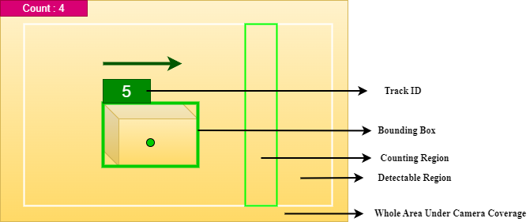

# Parcel Counter

Author: Soumit Das  ||  Email: 1803063soumit@gmail.com  ||  Mobile Phone: 01871773734

## Table of Contents
- [Parcel Counter](#parcel-counter)
  - [Table of Contents](#table-of-contents)
  - [Problem Understanding](#problem-understanding)
  - [Output of the Solution](#output-of-the-solution)
  - [Camera Coverage](#camera-coverage)
  - [Detectable Region](#detectable-region)
  - [Power Outage Management](#power-outage-management)
  - [Counting Region](#counting-region)
  - [Counting Parcels and Power Outage Management](#counting-parcels-and-power-outage-management)

## Problem Understanding
An image of sample-setup (Figure 1) was provided be used, where parcels are running on a conveyor belt. Computer vision technology will be used to count them.

Figure 1 : Probable Setup for this project

Key points considered from the provided sample setup:
* **Parcels may look similar.**
* **Parcels are not very tiny or small.**
* **Parcels are moving in one direction.**
* **Parcels are going one by one.**

In the event of a power outage, the belt will be turned off, and the light will go out, but the camera will continue running. When power is restored, already counted parcels should not be counted again.

## Output of the Solution
A sample setup was created at home to demonstrate how the solution worked.

Here is a video:

## Camera Coverage

In Figure 2, the yellow canvas represents the entire area covered by the camera. However, the full coverage might not be the region of interest because some spots may not clearly show the parcels.

Figure 2 : Experiment setup

## Detectable Region

A 'Detectable Region' has been defined within the camera's coverage area, as shown inside the white rectangle in Figure 2. Only parcels that enter this specific region will be detected and tracked.

## Power Outage Management
The system checks the brightness of the frame. If the frame gets darker, it will be understood that a power outage has occurred. Frames taken during the power outage are not sent to the detector and tracker, so the tracker will not be aware of the power cut and will not lose the track.
Even if one or two poorly lighted frames are sent to the tracker accidentally and tracking is lost, a further step has been taken (discussed in an upcoming section).

## Counting Region

As the parcels approach the 'Counting Region' (illustrated inside the green rectangle in Figure 2), they will be counted if their center point enters this area. Each parcel will be counted only once.

## Counting Parcels and Power Outage Management 

**Case-1**: When a parcel's ID is found inside the 'counting region', it is checked whether it is the same ID last located (location of center point) at the nearest point before/left to the counting region. If yes, then no tracking loss has occurred. Two subcases are considered:
- **Subcase-1**: If the ID is not the 'last_counted_id', it will be saved as the last_counted_id and the count value will be increased.
- **Subcase-2**: If the ID is the 'last_counted_id', nothing will be done.

**Case-2**: When a parcel's ID is detected inside the 'counting region', it is checked whether it is the same ID last located (location of center point) at the nearest point before the counting region. If no, then a tracking loss has occurred. This means after entering the counting region, the parcel received a new track ID. The reason might be anything (even accidentally getting some bad frames due to power outage. Because light does not turns out within just one frame.)

Here comes the critical part. The width of the counting region must be narrower than the half-width of a parcel's bounding box. This ensures that when a parcel's center point even reach last/right end of the counting region, part of the parcel remains outside the front/left line of the counting region. Consequently, the last parcel that approached the counting region most closely is the same parcel currently inside it. This means no other parcel's center point has come as close to the counting region as the current counting-candidate parcel.

So, that's how the lost track is found out.

Now steps to follow:
- It is checked whether the ID of the last_parcel_nearest_to_the_counting_region has already been counted. If not, the count will be increased.
- The saved ID of the last_parcel_nearest_to_the_counting_region will be changed to the ID of the current parcel inside the counting region.

